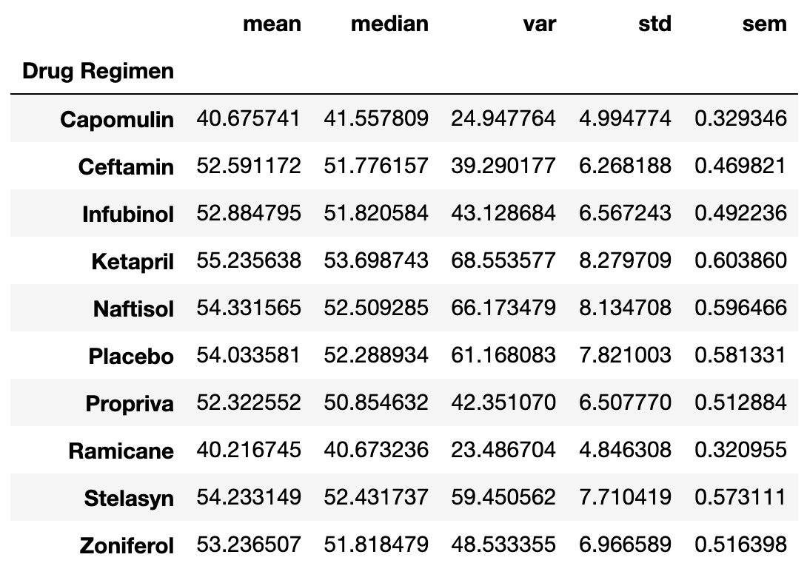
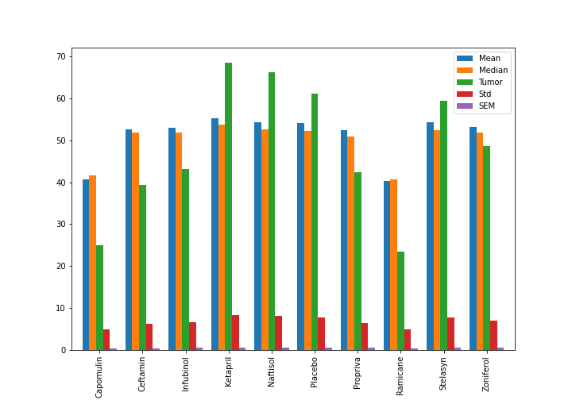
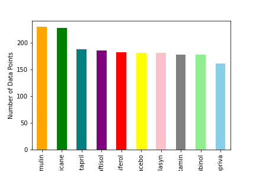
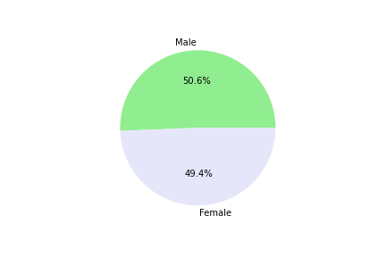
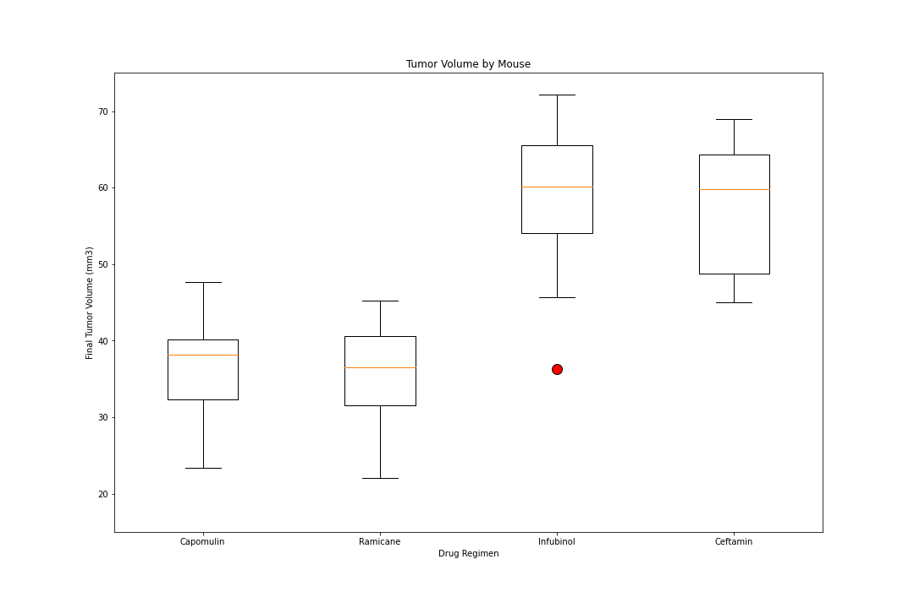
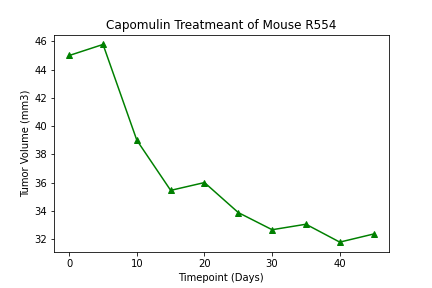
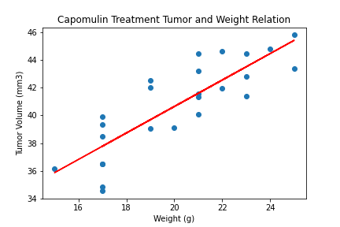

# Matplotlib Challenge - The Power of Plots

## Background

In this challenge, I use the matplotlib function to analyze the effectiveness of different drug regimens on tumor growth. The data was gathered from an animal study where mice with tumors were given different drugs to determine what drug would shrink the tumor the most. 

## Data Source
* Mouse_metadata.csv
* Study_results.csv

## Contents
## Summary DataFrame by drug regimen

## Summary plot by drug regimen

## Number or data points for each drug regimen

## Percentage of Male & Female mouses in the study

## Capomulin Outliers

* Values below 20.70456164999999 could be outliers.
* Values above 51.83201549 could be outliers.

## Ramicane Outliers

* Values below 17.912664470000003 could be outliers.
* Values above 54.30681135 could be outliers.

## Infubinol Outliers

* Values below 36.83290494999999 could be outliers.
* Values above 82.74144559000001 could be outliers.

## Ceftamin Outliers

* Values below 25.355449580000002 could be outliers.
* Values above 87.66645829999999 could be outliers.

## Box Plot of the final tumor volume for each mouse across four drug regimens of interest

## Tumor Volume over time for mouse R554 

## Mouse weight vs. Average Tumor Volume for mice on the Capomulin regimen

